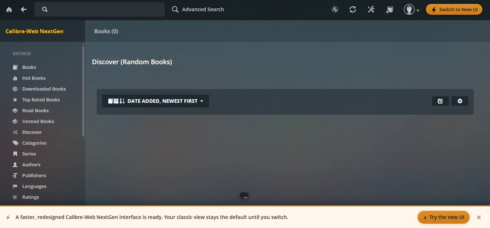

# Dynamic-Testing
Testing a running application by interacting with its features and manipulating controlled requests to determine whether potential vulnerabilities identified during static analysis can actually be reproduced and have a security impact.

**Prepare the Dynamic Testing Environment**

Before manipulating requests, we need to establish exactly what version of the application we're testing and make sure the target repository hasn't changed since our static analysis.

Your Lab 4 baseline was:

Target: Calibre-Web NextGen
Version: 4.1.43
Commit: 7e9221f455329bb3e6611b4652ac23b7f8629bb0
Branch: main

Open PowerShell in: git -C .\targets\Calibre-Web-NextGen status --short

We want to make sure the target source code itself has not been modified before dynamic testing.

If nothing appears, that's a clean working tree.

That means the Calibre-Web NextGen target repository has no modified or untracked files.

Verify the exact target commit

Run: git -C .\targets\Calibre-Web-NextGen rev-parse HEAD

We expect: 7e9221f455329bb3e6611b4652ac23b7f8629bb0

That matches our Lab 4 baseline exactly:

7e9221f455329bb3e6611b4652ac23b7f8629bb0

Target commit: VERIFIED

Verify the target branch

Run: git -C .\targets\Calibre-Web-NextGen branch --show-current

We expect: main

Branch: main 
Commit: previously verified 
Working tree: clean 

The Lab 5 baseline is matching Lab 4.

Verify the application version

Run: Select-String -Path .\targets\Calibre-Web-NextGen\cps\constants.py -Pattern "STABLE_VERSION"

We’re expecting the version associated with our baseline: 4.1.43

No output means STABLE_VERSION isn't defined in that file under that exact name. Nothing is wrong—we just searched for the wrong constant.

Let's locate where 4.1.43 is defined in the target source.

Run: Get-ChildItem .\targets\Calibre-Web-NextGen\cps -Recurse -File | Select-String -Pattern "4\.1\.43" | Select-Object -First 10

That also returned no results. So 4.1.43 is not stored as a literal string anywhere under the cps directory at this commit. That's okay—the exact Git commit is the stronger reproducibility identifier anyway, and we've already verified it.

Rather than spend more time chasing a version string, we'll record:

Target commit: 7e9221f455329bb3e6611b4652ac23b7f8629bb0
Branch: main
Working tree: Clean

Check how the application is launched

Run: Get-ChildItem .\targets\Calibre-Web-NextGen | Select-Object Name

We found two important files:

cps.py — likely the Python application entry point.
VERSION — this is probably where the project stores its version. That explains why our earlier search under cps returned nothing.
Verify the version

Run: Get-Content .\targets\Calibre-Web-NextGen\VERSION

After that, we'll move to starting the local application for dynamic testing.

That confirms the complete Lab 5 testing baseline:

Calibre-Web NextGen: 4.1.43 
Branch: main 
Commit: 7e9221f455329bb3e6611b4652ac23b7f8629bb0 
Working tree: Clean 

Activate your research environment

Before we attempt to launch the application, activate your existing virtual environment: .\.venv\Scripts\Activate.ps1

That's the same PowerShell execution-policy restriction we encountered earlier. Your .venv itself isn't broken.

Temporarily allow the activation script

Run this first: Set-ExecutionPolicy -Scope Process -ExecutionPolicy Bypass

Then run: .\.venv\Scripts\Activate.ps1

We want the prompt to change to: (.venv) PS C:\Users\eelve\Vulnerability-Research-Lab>

The screenshot confirms the virtual environment is active:

(.venv) PS C:\Users\eelve\Vulnerability-Research-Lab>

Check the application's startup options

Before launching anything, let's see what this exact version expects.

Run: python .\targets\Calibre-Web-NextGen\cps.py --help

Then we'll use the correct startup command for your local testing environment.

this tells us exactly what's wrong. The application reached its Python code, but your research .venv doesn't currently have Flask installed:

ModuleNotFoundError: No module named 'flask'

That's a dependency/environment issue, not a Calibre-Web vulnerability or application failure.

**Find the project's dependency configuration**

Since this repository has pyproject.toml, let's inspect how its dependencies are defined before installing anything.

Run: Select-String -Path .\targets\Calibre-Web-NextGen\pyproject.toml -Pattern "dependencies|flask" -Context 2,5

We'll install dependencies using the method this repository expects, rather than manually installing Flask and potentially missing dozens of other required packages.

Perfect. This confirms the project declares its runtime dependencies directly in pyproject.toml, including Flask and the authentication-related packages we’ll eventually need.

For Lab 5 — Step 1: Prepare the Dynamic Testing Environment, the next move is to install the target itself into your already-active .venv. Since we want to preserve the source checkout and install exactly from the local authorized target. 

run only: python -m pip install -e .\targets\Calibre-Web-NextGen

The -e performs an editable local install, so Python uses your cloned Calibre-Web NextGen source while installing the dependencies declared in pyproject.toml.

This may install quite a few packages and could take several minutes. Do not start the application yet.

The install did not complete, and the important part is:

Failed to build faust-cchardet python-ldap

Several other packages built successfully, so we don't need to restart blindly. These two dependencies commonly involve native/compiled components, so first we should inspect the actual build error rather than changing your environment.

Lab 5 — Step 1A: Diagnose python-ldap

Run only this: python -m pip install python-ldap -v

Capture the last 20–30 lines around the first actual compiler/error message, especially anything mentioning:

error:
Microsoft Visual C++
cl.exe
lber.h
ldap.h

That confirms python-ldap is the blocker, but this screenshot still only shows pip’s final summary. The actual compiler error occurred earlier in the output.

Before installing Visual C++ tools or changing Python versions, I want the exact cause.

Save the full error

Run: python -m pip install python-ldap -v *> .\python-ldap-build.txt

Then run: Select-String -Path .\python-ldap-build.txt -Pattern "fatal error|error C|ldap.h|lber.h|cl.exe|Microsoft Visual C" -Context 3,3

Then we'll know whether we're dealing with missing C++ build tools, missing LDAP development headers/libraries, or another Python 3.13 compatibility issue. Don't install anything else yet.

now we have the exact cause.

Your log says:

error: Microsoft Visual C++ 14.0 or greater is required.

Because python-ldap is specifically for the optional LDAP authentication feature, we can first determine whether Calibre-Web NextGen can run locally without LDAP support. Candidate #4 can be handled separately later if we need an LDAP-capable environment.

check the project's startup instructions

From your current project directory, run: Get-ChildItem .\targets\Calibre-Web-NextGen -Name | Select-String "README|requirements|setup|docker"

We'll use the project's supported installation/startup method rather than forcing a 7 GB compiler installation onto your machine.

That confirms the repository provides both Docker and regular installation documentation. Since disk space is already tight, I don't want to have you install Docker Desktop—it could consume even more space.

Check the README installation instructions

Run: Select-String -Path .\targets\Calibre-Web-NextGen\README.md -Pattern "install|Windows|pip|Docker" -Context 3,6

Then we'll choose the smallest supported installation path that lets us dynamically test Candidates #1, #2, #5, and #6 without installing 7 GB of Visual Studio tooling. We can revisit the LDAP-specific candidate separately.

I reviewed the output. It gives us an important answer: the project's documented Quick Start is Docker-based—it explicitly lists Docker and Docker Compose as requirements. It then starts the application with docker compose up -d and expects it at localhost:8083.

Since I don't have enough disk space for the ~7 GB Visual C++ installation, I don't want to send you down the Docker route either without checking storage first.

Check available disk space

Run only: Get-PSDrive C | Select-Object Used,Free

Once I see exactly how much free space you have, we'll choose the lowest-storage path for getting the local target running

I currently have 50,713,722,888 bytes free ≈ 47.2 GB on C:.

So the issue wasn't that my computer lacked 7 GB total I have plenty of free space. The Visual Studio installer likely wanted roughly 7 GB for the selected workload, and you understandably didn't want to spend that much just for one dependency.

For this lab, I'd still avoid that large installation until we know it's necessary. Let's see whether Windows already has Docker or Podman installed, since the project's README supports those approaches.

Check existing container tools

Run: docker --version
podman --version

neither Docker nor Podman is installed. So we have three potential routes, and installing Docker just to solve this would add unnecessary overhead.

The best next move is to determine whether the application already supports disabling optional LDAP functionality. If it does, we may be able to run the other Lab 5 tests using your existing Python environment without python-ldap.

Check how LDAP is imported

Run only: Select-String -Path .\targets\Calibre-Web-NextGen\cps\*.py -Pattern "import ldap|from ldap|flask_simpleldap|SimpleLDAP" -Context 2,3

We're specifically checking whether LDAP is conditionally imported. If it is, we'll try to bypass that optional dependency 
cleanly rather than installing several gigabytes of development tools.

This result is useful, but it doesn't show an LDAP import. It only found the word LDAP in web.py, where the application calls its LDAP service:

ldap_user_details = services.ldap.get_object_details(username)

That suggests the actual python-ldap import may live deeper under cps\services, which our cps\*.py search didn't recursively inspect.

Lab 5 — Step 1G: Search recursively

Run this one command: Get-ChildItem .\targets\Calibre-Web-NextGen\cps -Recurse -Filter *.py | Select-String -Pattern "import ldap|from ldap|flask_simpleldap|SimpleLDAP" -Context 2,3

This should tell us whether LDAP support is conditionally loaded. If it is, we may be able to run the application without 
python-ldap and postpone Candidate #4 — LDAP fallback until later.

Excellent. This gives us the answer we were looking for.

cps\services\__init__.py deliberately handles the missing LDAP module:

try:

    from . import simpleldap as ldap
    
    from .simpleldap import ldapVersion
    
except ImportError as err:

    log.debug("Cannot import simpleldap, logging in with ldap will not work: %s", err)
    
    ldap = None
    
    ldapVersion = None

So LDAP is optional at runtime. We can postpone Candidate #4 and avoid installing the ~7 GB C++ build environment.

The remaining blocker from the original installation was faust-cchardet. Let's determine its exact failure before changing anything.

Diagnose faust-cchardet

Run: python -m pip install faust-cchardet -v *> .\faust-cchardet-build.txt

Then: Select-String -Path .\faust-cchardet-build.txt -Pattern "fatal error|error C|Microsoft Visual C|Failed|ERROR" -Context 3,3

If it also only fails because it wants the C++ compiler, we'll look at bypassing that optional dependency rather than installing the large toolchain.

The command returned no matches, which means faust-cchardet did not fail with the same obvious Visual C++ error pattern we saw for python-ldap.

Run: Get-Content .\faust-cchardet-build.txt -Tail 40

faust-cchardet is resolved. This output confirms:

Successfully installed faust-cchardet-3.2.0

So the only known failed dependency now is python-ldap, and we already confirmed the application handles LDAP as optional when that import isn't available.

erify the core environment

Now run only: python -c "import flask, sqlalchemy; print('Flask:', flask.__version__); print('SQLAlchemy:', sqlalchemy.__version__)"

If that passes, we'll continue toward getting Calibre-Web NextGen running locally without installing the 7 GB Visual C++ 
package.

This tells us something important: the failed editable install rolled back before installing Flask, so we don't yet have a runnable core environment.

We should not manually install Flask alone because Calibre-Web NextGen has many dependencies, and that could leave us with an inconsistent environment.

Since faust-cchardet is now successfully installed and python-ldap is the remaining known blocker, let's check whether pip can install the project while skipping dependency resolution. First, though, we need to see which dependencies are already present.

Check installed packages

Run: python -m pip list

This confirms the environment currently contains your research tooling and faust-cchardet, but not the Calibre-Web runtime dependencies such as Flask and SQLAlchemy.

Rather than manually installing dozens of packages, we can have pip resolve the target normally while telling it to skip only python-ldap. A clean way is to use a pip constraint that makes LDAP unavailable—but before doing that, I want to inspect whether the project already provides a supported non-LDAP dependency group.

Inspect dependency definitions

Run this: Get-Content .\targets\Calibre-Web-NextGen\pyproject.toml | Select-Object -Skip 30 -First 90

We're looking at the entire runtime dependency block, not just Flask/LDAP. Then I can give you one controlled installation command that installs everything needed for the local application while avoiding the native python-ldap build.

This confirms there is no separate non-LDAP dependency group. It also reveals something important about faust-cchardet: the project requires >=2.1.18,<2.1.20, while we installed 3.2.0 manually. So we should not treat 3.2.0 as satisfying the target's declared environment.

Rather than modifying pyproject.toml or forcing incompatible versions, let's check whether the repository's AI_README.md provides a supported bare-metal/Windows setup. The main README specifically says that file is a setup guide intended for an AI assistant to follow.

Step 1K

Run only: Get-Content .\targets\Calibre-Web-NextGen\AI_README.md -First 120

We'll follow the project's own setup guidance if it provides a lower-storage route. I don't want to alter the target's dependency constraints just to make the installation succeed, because maintaining the target's intended configuration matters for valid vulnerability research.

If WSL2 is already available, we'll determine how much additional installation is actually necessary before downloading Docker Desktop.

This settles it. The project's own setup guide says that on Windows, Docker Desktop + WSL2 is the supported setup, and that if Docker isn't installed, it is a prerequisite. So continuing to fight the bare-metal Python dependencies would move us away from the target's intended runtime.

Because you have about 47 GB free, Docker may still be feasible, but before downloading anything we should check whether WSL2 is already installed.

Check WSL

Run only: wsl --status

WSL2 is already enabled, and Default Version: 2 is exactly what we wanted. The kernel is older, but we don't need to change anything yet.

Before considering Docker Desktop, let's check whether you already have a Linux distribution installed under WSL.

Run only: wsl --list --verbose

If Ubuntu or another Linux distribution is already installed and shows VERSION 2, that removes another setup requirement. Don't run wsl --update or install Docker yet.

That confirms the situation:

WSL2: installed 

Default WSL version: 2 

Linux distribution: not installed 

Docker: not installed 

Since the project's Windows instructions call for WSL2 + Docker Desktop, the next smallest step is installing a Linux distribution. Ubuntu itself is much smaller than the 7 GB Visual Studio workload.

See available WSL distributions

Run only: wsl --list --online

We'll choose the appropriate Ubuntu version from Microsoft's available list before installing anything.

Ubuntu is available, so we can continue with the project's supported Windows path.

Install Ubuntu for WSL2

Run: wsl --install -d Ubuntu

This will download and install Ubuntu. It may ask you to restart Windows. If it does, restart before continuing.

After installation, Ubuntu may open and ask you to create a Linux username and password. These are just for your local Ubuntu environment; they do not need to match your Windows credentials.

Ubuntu installed successfully. The important lines are:

Ubuntu has been installed.

Launching Ubuntu...

I'm currently logged in as root, which is okay for this temporary research environment. Notice I'm currently under /mnt/c/...; the project's instructions recommend keeping its Docker runtime data inside the WSL filesystem, so we'll follow that when we get there.

Verify WSL from Windows

First exit Ubuntu: exit

Once you're back at your PowerShell prompt, run: wsl --list --verbose

Verification passed:

NAME      STATE     VERSION
* Ubuntu  Stopped   2

So Ubuntu is installed correctly and configured as WSL2. Stopped is normal because you exited the Ubuntu session.

 **Step 1P: Docker Desktop**

We can now move to the project's documented Windows runtime approach. Install Docker Desktop for Windows from the official Docker site:

Click on download

Select the version for your computer

Select your configurations and what for Docker to install

During installation, keep the WSL 2 backend option enabled. You do not need Hyper-V if the installer offers WSL2 as the backend.

After installation, launch Docker Desktop and wait until it reports that the Docker engine is running.

**Configure Docker storage on D:**

Click the ⚙️ Settings icon near the top-right.

Then look for Resources → Advanced.

We want the setting called something like Disk image location.

Select so Docker's large images/containers live on:

D:\Vulnerability-Research-Docker

Confirm that Disk image location now points to your D: drive, then click Apply & restart.

Docker will restart and move its disk image. Keep the Toshiba drive connected during this process.

Once Docker comes back and shows Engine running. I'll verify the storage location before pulling Calibre-Web NextGen.

This confirms Docker Engine is running after the storage move. It also shows a disk limit of about 1006.85 GB, so Docker now has substantial storage available instead of being constrained by C:

**Prepare Dynamic Testing Environment.**

Before pulling Calibre-Web NextGen, let's verify from PowerShell that Docker itself is healthy.

Run: docker info --format "Docker Root Dir: {{.DockerRootDir}} | Server Version: {{.ServerVersion}}"

That confirms the Docker backend is responding correctly:

Docker Root: /var/lib/docker

Server Version: 29.8.0

Because Docker Desktop's WSL disk image was moved to D:\Vulnerability-Research-Docker\DockerDesktopWSL, /var/lib/docker is the normal Linux-side path inside that disk. We're ready to proceed.

**Calibre-Web NextGen setup**

Let's first check whether the target repository already contains a Docker Compose file. From:

C:\Users\eelve\Vulnerability-Research-Lab

run: Get-ChildItem .\targets\Calibre-Web-NextGen -Filter "*compose*" | Select-Object Name

We'll use the target project's own supported configuration rather than inventing one.

confirms the repository includes both:

docker-compose.yml — normal deployment
docker-compose.yml.dev — development configuration

For our controlled Lab 5 dynamic testing, let's inspect the normal Compose configuration before running it. This lets us verify the image, ports, volumes, and environment settings first.

Run: Get-Content .\targets\Calibre-Web-NextGen\docker-compose.yml

We'll review the configuration first and make sure its persistent test data won't accidentally go somewhere we don't want.

This tells us exactly what we need before launching it.

The Compose file uses the official NextGen image, exposes 8083, and requires four host-side volume paths. We should not run this file unchanged, because /path/to/... are placeholders. For Lab 5, we'll create isolated test directories on your external D: drive so we don't mix research data with your real files.

**Create isolated test-data folders**

Run this one command: 

You should end up with: New-Item -ItemType Directory -Force -Path "D:\Vulnerability-Research-Docker\calibre-lab5\config","D:\Vulnerability-Research-Docker\calibre-lab5\ingest","D:\Vulnerability-Research-Docker\calibre-lab5\library","D:\Vulnerability-Research-Docker\calibre-lab5\plugins"

D:\Vulnerability-Research-Docker\calibre-lab5\

├── config

├── ingest

├── library

└── plugins

These will be Lab 5-only test data, which is exactly what we want for controlled dynamic testing and later restoration. After, Then we'll create a separate Lab 5 Compose file rather than modifying the target repository's original docker-compose.yml.

This confirms all four isolated Lab 5 directories were created successfully on the D: external drive:

config, ingest, library, and plugins.

**create our Lab 5 Compose file**

We won't modify the repository's original Compose file. From your current PowerShell location, run: Copy-Item .\targets\Calibre-Web-NextGen\docker-compose.yml .\docker-compose-lab5.yml

Then verify it exists: Get-Item .\docker-compose-lab5.yml | Select-Object Name,Length

After that, we'll edit only our copy to point those four volumes to D:\Vulnerability-Research-Docker\calibre-lab5\..., while preserving the target's original configuration for comparison and evidence.

This confirms our separate docker-compose-lab5.yml was created successfully at 3,507 bytes. The original target Compose file remains untouched.

Now we'll modify only the four placeholder volume paths in our Lab 5 copy.

**Replace the volume paths**

Run this PowerShell block: $compose = Get-Content .\docker-compose-lab5.yml -Raw
$compose = $compose.Replace('/path/to/config/folder','D:/Vulnerability-Research-Docker/calibre-lab5/config')
$compose = $compose.Replace('/path/to/the/folder/you/want/to/use/for/book/ingest','D:/Vulnerability-Research-Docker/calibre-lab5/ingest')
$compose = $compose.Replace('/path/to/your/calibre/library','D:/Vulnerability-Research-Docker/calibre-lab5/library')
$compose = $compose.Replace('/path/to/your/calibre/plugins/folder','D:/Vulnerability-Research-Docker/calibre-lab5/plugins')
Set-Content .\docker-compose-lab5.yml $compose

No output is normal.

Then verify only the volume section: Select-String -Path .\docker-compose-lab5.yml -Pattern "D:/Vulnerability"

We still won't start the container yet. I want to validate the resulting Compose configuration first so we don't discover a path/YAML problem after downloading the image.

The replacement worked. Your screenshot confirms all four Lab 5 bind mounts now point to the external D: drive:

D:/Vulnerability-Research-Docker/calibre-lab5/config:/config

D:/Vulnerability-Research-Docker/calibre-lab5/ingest:/cwa-book-ingest

D:/Vulnerability-Research-Docker/calibre-lab5/library:/calibre-library

D:/Vulnerability-Research-Docker/calibre-lab5/plugins:/config/.config/calibre/plugins

One extra match is just a comment mentioning the config path, so that's fine.

Next step — validate the Compose file

Before downloading or starting anything, run: docker compose -f .\docker-compose-lab5.yml config --quiet

If the configuration is valid, it will normally return to the prompt with no output. Once this passes, we'll be ready for the first controlled startup of Calibre-Web NextGen for Lab 5.

No output and a return to the PowerShell prompt means the Compose configuration passed validation. 

We're ready for the first controlled startup of Calibre-Web NextGen.

**First container startup**

Run: docker compose -f .\docker-compose-lab5.yml up -d

This will pull the Calibre-Web NextGen image and start the local container. The first run may take several minutes. We won't open localhost:8083 until we confirm the container is actually healthy.

This is a successful first startup.

27/27 image layers pulled

ghcr.io/new-usemame/calibre-web-nextgen:latest — Pulled

Docker network — Created

calibre-web-nextgen — Started

So the container is running, but we still need to verify its actual state before opening the application.

**Verify container status**

Run: docker compose -f .\docker-compose-lab5.yml ps

We're looking for calibre-web-nextgen showing Up and port 8083 mapped correctly. After that, we'll check its startup logs before opening the web interface.

This confirms the container is running correctly:

Status: Up 4 minutes (healthy)

Port: 8083 → 8083/tcp

Container: calibre-web-nextgen

That (healthy) status is exactly what we wanted. 

Before opening the application, let's do one final startup-log check for errors.

Run: docker compose -f .\docker-compose-lab5.yml logs --tail=30

We'll open Calibre-Web NextGen at localhost:8083 and establish our Lab 5 baseline.

The startup logs look clean. The important checks all passed:

Container is healthy.
Gevent server started on port 8083.

The localhost connection test succeeded.

/cwa-book-ingest and /calibre-library were recognized.

Docker Desktop correctly switched file watching to polling.

Database schema initialized successfully.

Checksum/backfill completed successfully.

No startup exception or fatal error appears in the log you provided.

One thing to note for later: the log says HARDCOVER_TOKEN is configured because the stock Compose file contains the placeholder your_hardcover_api_key_here. That's not blocking us, but we'll clean that up later if necessary.

**Open the application**

Now open your browser and go to:

http://localhost:8083

This stays entirely on your local machine.

This is the baseline we wanted. The application is reachable locally at localhost:8083, and it redirects unauthenticated access to /login?next=%2F. The login page renders normally.

**Prepare Dynamic Testing Environment**

The Docker portion is now working.

Before trying credentials, we need to determine the application's intended initial/default administrator login procedure rather than guessing.

From PowerShell in C:\Users\eelve\Vulnerability-Research-Lab, run: docker compose -f .\docker-compose-lab5.yml logs | Select-String -Pattern "admin|password|username|login|credential" -CaseSensitive:$false

We'll use that to determine whether the fresh installation generated credentials or expects a documented default. Don't enter random credentials yet.

That confirms the logs do not expose or generate initial credentials. The two matches are only authentication-related configuration messages:

SESSION_COOKIE_SECURE set to False (Standard/LDAP login)

Magic Link QRCode is enabled

So we shouldn't guess credentials.

find the documented/default login in the source

Run: Get-ChildItem .\targets\Calibre-Web-NextGen -Recurse -File -Include *.md,*.py,*.yml,*.yaml | Select-String -Pattern "admin123|default password|default username|initial password|initial login" -CaseSensitive:$false | Select-Object -First 20 Path,LineNumber,Line

This keeps us within the authorized local source repository and will tell us how a fresh installation is intended to be accessed.

We found the intended fresh-install credentials directly in the project's source:

Username: admin

Password: admin123

The strongest evidence is cps\constants.py, which defines DEFAULT_PASSWORD = "admin123", plus cps\ub.py, which documents creation of the default admin account. The repository documentation also explicitly states admin/admin123.

**Initial login**

On the login page, enter:

Username: admin

Password: admin123

This is the application's documented default account in our isolated local instance—not a credential-guessing test. Don't change the password, create users, or modify settings yet. We want to capture the clean authenticated baseline first.

This confirms the documented default administrator login succeeded and the authenticated application is functioning normally.

Your screenshot also establishes a useful Lab 5 baseline: authenticated admin session, Books (0), empty library, and the classic Calibre-Web NextGen interface. Save this screenshot as evidence for Lab 5 / Step 1 — Initial Authenticated Baseline.

We now need controlled test data before Candidate #1 can be tested. The read-status authorization candidate requires at least one book object, and later we'll need separate users with different visibility/access conditions.

**Verify the library is empty on disk

Don't change anything in the web interface yet. In PowerShell run: Get-ChildItem "D:\Vulnerability-Research-Docker\calibre-lab5\library" -Force

No output is expected if our clean library directory is still empty.

After that we'll add a harmless test book and then create the controlled accounts needed for Candidate #1.

This is actually the expected clean-library state.

The directory isn't literally empty because Calibre-Web NextGen initialized its database files:

metadata.db

metadata.db-shm

metadata.db-wal

But there are no book files/directories yet, which matches the web interface showing Books (0). So we have a clean baseline. 

Create harmless test book #1

Rather than use a real copyrighted book, we'll create our own simple .txt test book. Run: Set-Content "D:\Vulnerability-Research-Docker\calibre-lab5\ingest\Lab5-Test-Book-01.txt" "Lab 5 authorized vulnerability research test book. No real user data."

After that, refresh the Calibre-Web page.

We're looking for the book count to change from Books (0) to Books (1). If it doesn't, we'll check the ingest logs rather than guessing.

The screenshot confirms the book was not ingested—the interface still shows Books (0). That's useful evidence; we won't change anything blindly.

The most likely next place to look is the ingest service logs.

Check what happened to the test file

Run: docker compose -f .\docker-compose-lab5.yml logs --since=5m | Select-String -Pattern "Lab5|ingest|txt|error|unsupported|failed" -CaseSensitive:$false

This tells us the ingest did work, but it took about 73 seconds to convert the TXT to EPUB. The important lines are:

New file detected → Converting file from txt to epub → EPUB output written → Conversion ... complete

The repeated Fontconfig messages are warnings about its cache directories; they did not prevent the conversion.

Refresh http://localhost:8083 again now.

Don't add another book yet.

We're checking whether Books (0) has now changed to Books (1).

That confirms the complete ingest path is working. Your screenshot shows Books (1) and Lab5-Test-Book-01 is visible in the local library. This is good Lab 5 baseline evidence.

We now have the application running, authenticated admin access, an isolated database/library, and one controlled test object. Next we need a non-admin test user for Candidate #1.

Open User Management

In Calibre-Web NextGen, click the wrench/tools icon 🔧 near the top-right.

Look for Admin, User Management, Edit Users, or a similar user-management option.

ADD NEW USER

We'll configure this account specifically for Candidate #1 so it has normal user access but no administrative privileges.

Change Username to: lab5-user-a 

Then scroll down just enough so we can see the email/password fields and permissions/options below it.

Set a lab-only password that satisfies those requirements. For example:

Lab5UserA!2026

Since this is an isolated local research account, that's fine for our controlled lab.

Then scroll farther down until you reach the permissions/roles section

This is exactly what we need. All permissions are currently unchecked.

For Candidate #1 — Read-Status Object Authorization, keep this account as a basic non-admin user. We don't need Admin, Upload, Edit, Download, or Public Shelf permissions for this test.

Check only:

☑ Allow eBook Viewer

Leave everything else unchecked, especially Admin User.

Then click SAVE.

That gives us our controlled low-privilege account for the authorization test.

**Create Book 2**

In PowerShell, run: Set-Content "D:\Vulnerability-Research-Docker\calibre-lab5\ingest\Lab5-Test-Book-02.txt" "Lab 5 authorization boundary test book. No real user data."

 

Then wait about 1–2 minutes for Calibre-Web to ingest/convert it and refresh the Books page.

We want to see: 

Lab5-Test-Book-01

Lab5-Test-Book-02

The dataset now has Books (2):

Lab5-Test-Book-01

Lab5-Test-Book-02

Now we need to create the actual authorization boundary. Book 1 will remain visible to lab5-user-a, while we'll make Book 2 unavailable to that user.

**Open Book 2**

While still logged in as admin, click Lab5-Test-Book-02.

Don't change anything yet.

We want to see what editing/category/tag options are available so we can choose the cleanest supported way to restrict Book 2 from lab5-user-a.

Book 2 has ID 3. Record that—we'll need it later when we manipulate the read-status request.

We also see + Add tag, which gives us a clean way to create a visibility restriction if Calibre-Web's user settings support tag-based restrictions.

tag Book 2

Click + Add tag and add: lab5-restricted

Apply/save the tag if prompted.

We'll configure lab5-user-a so this tag is excluded from their normal library view. That will establish our control condition: admin can access Book ID 3, but lab5-user-a cannot.

Book ID 3 now has the tag lab5-restricted.

Now we need to make that tag invisible to lab5-user-a.

Next step — edit lab5-user-a

Go back to:

Admin Settings → Users → Edit Users

Select lab5-user-a.

Scroll through that user's settings and look for something related to visibility, tags, restrictions, allowed/denied tags, or content restrictions.

We'll configure it so:

Book 1 → visible

Book 3 → hidden because of lab5-restricted

That distinction is what will let us properly test whether the server enforces object-level authorization when we later submit Book ID 3 directly.

this is exactly the section 

Click: ADD ALLOWED/DENIED TAGS

Type (lab5-restricted) to add the rule

Click deny to add View Restriction.

Click CLOSE.

Then, back on the lab5-user-a Edit User page, scroll to the bottom and click SAVE to save the user's restriction.

The authorization restriction is now saved.

**test the account normally**

Log out of the admin account.

Then log in as:

Username: lab5-user-a
Password: the password you created for that account.

Once logged in, click Books.

Don't try to access Book ID 3 directly yet. We first need to establish normal authorized behavior.

Expected control result: Book 1 is visible, and Lab5-Test-Book-02 (ID 3) is absent. If that's what happens, we'll have established the visibility boundary before beginning the actual authorization test.

This is the control evidence we needed.

Logged in as lab5-user-a, the library shows Books (1) and only Lab5-Test-Book-01. Book ID 3 (Lab5-Test-Book-02) is successfully hidden by the deny-tag restriction.

So we have established the authorization boundary:

Admin: can access Book 3

lab5-user-a: cannot normally see Book 3

identify Book 1's ID

While still logged in as lab5-user-a, click Lab5-Test-Book-01.

Don't mark it read/unread yet.

After that we'll establish normal read-status behavior for an authorized book before changing anything involving hidden Book ID 3.

lab5-user-a sees Books (1) and only Lab5-Test-Book-01; restricted Book 2 is hidden.

Now we test the read-status function on an object the user is authorized to access before touching restricted Book 2.

Now I'll

Open Lab5-Test-Book-01.

Ctrl + Shift + I.

)

At the top of DevTools, click the + next to Console.

A menu of tools will appear. Select Network.

Network capture is working, and the red record button is active. You're ready for the control test.

**Control Request**
You're currently on the Book 1 details page, which is where we want to be.

Click the Clear network log button — the circle with a slash ⊘ near the upper-left of the Network panel.

Leave DevTools recording.

Then, on the Book 1 page, click the small Mark As Read icon — the checkmark-in-a-box icon underneath the Read now button.
After you click it, stop there.

Look at the Network panel for a new request. Based on our static analysis, we expect something associated with:
toggleread

It may appear simply as 2 in the Name column.

We will verify the control request before doing the manipulated request.

That is the control request we wanted.

Your Network panel shows:

- Name: 2
  
- Status: 200
  
- Type: xhr
  
- Only one request after clearing the log
  
So Candidate #1 control behavior is captured successfully.

Next — verify the control request

Click the row named 2 in the Network panel.

Then click Headers in the panel that opens.

Under General, we want to see:

Request URL: http://localhost:8083/ajax/toggleread/2

Request Method: POST

Status Code: 200 OK

Control request is verified. Your screenshot clearly shows:

Request URL:    http://localhost:8083/ajax/toggleread/2

Request Method: POST

Status Code:    200 OK

This is good evidence for the portfolio because it establishes the legitimate baseline for a book the user is authorized to see.

**Candidate #1 — manipulated request**

Now I'm going to log back in as lab5-user-a and return to Book 1 (/book/2). Keep DevTools open.

I'm going to resend the same authenticated read-status request, changing only the object ID from 2 to 3. That's the core authorization test.

Right-click the 2 request in the Network list and select Edit and Resend.

Change only the URL from: http://localhost:8083/ajax/toggleread/2

to: http://localhost:8083/ajax/toggleread/3

- Method remains POST
- 
- Original control was /ajax/toggleread/2
- 
- Computed URL now shows /ajax/toggleread/3
- I have not sent it yet
- 
That establishes that the only security-relevant variable we're changing is the book ID: 2 → 3.

Now execute the manipulated request by clicking the blue send button

Your screenshot shows the manipulated URL correctly as:
http://localhost:8083/ajax/toggleread/3

but the Network Console reports:

Status: FETCH_ERROR

Size: 0 bytes

So Edge's Edit and Resend mechanism itself did not give us an HTTP response. We therefore don't yet know whether the server accepted or rejected Book ID 3.

Next step — check whether the request reached the serve.

In PowerShell run: docker logs calibre-web-nextgen --tail 30

I'm checking whether POST /ajax/toggleread/3 actually reached Calibre-Web. If it did, we'll use that evidence and independently check the database. If it didn't, I'll use a different controlled way to resend the authenticated request instead of relying on Edge's Network Console.

This log tells us something important: I do not see a Book 3 read-status event after the manipulated attempt. The visible read-status 

entries are all for Book 2, for example: Book 2 readbit toggled

There is no corresponding: Book 3 readbit toggled

So the Edge FETCH_ERROR appears to have prevented the manipulated request from reaching the application successfully. Candidate #1 has not passed or failed yet.

I'll retry the manipulated request from the browser Console.

In DevTools, I'll click the Console tab at the top.

By using my existing authenticated browser session. That will avoid Edge's broken Edit-and-Resend behavior and let us see the actual server response.

Using existing authenticated browser session. That will avoid Edge's broken Edit-and-Resend behavior and let us see the actual server response. Let's use a cleaner method that stays inside the authenticated browser session.

The red CSP errors are from the earlier Network Console resend attempt; we can ignore them for this test.

Click at the > prompt near the bottom of the main Console and enter this one command:

fetch('/ajax/toggleread/3', {method:'POST'}).then(async r => console.log('STATUS:', r.status, 'BODY:', await r.text()))

This uses the current lab5-user-a browser session and changes only the target to restricted Book ID 3.

We're specifically looking for:

STATUS: ...

BODY: ...

After that, we'll independently verify the server-side database state before drawing any vulnerability conclusion.

Edge is blocking paste as a self-XSS protection; the yellow message confirms it.

At the > prompt, manually type:

allow pasting

Edge did not enable pasting; it interpreted allow pasting as JavaScript and returned Unexpected identifier 'pasting'. Nothing was sent to the application

I can type the test command manually. At the > prompt in the top Console, manually type this shorter command:

fetch('/ajax/toggleread/3',{method:'POST'})

this time the manipulated request definitely reached the server.

Your screenshot shows:

POST http://localhost:8083/ajax/toggleread/3

400 (BAD REQUEST)

So we now have:

Control

POST /ajax/toggleread/2 → 200 OK

Manipulated
POST /ajax/toggleread/3 → 400 Bad Request

But we cannot conclude Candidate #1 is blocked yet. A 400 could come from authorization logic, missing request data/CSRF expectations, or another validation condition. We need to see what the application logged.

Next step

In PowerShell, run: docker logs calibre-web-nextgen --tail 20

and press Enter.

I'm specifically looking for activity at the time of that /ajax/toggleread/3 request. Then we'll determine why it returned 400 and whether Book 3's server-side state changed despite the response.

I've found the reason for the 400.
The key log entry is:

INFO {flask_wtf.csrf:263} The CSRF token is missing.

So the 400 was not an authorization rejection. Our Console fetch() omitted the CSRF token that the legitimate UI request includes. 

Therefore Candidate #1 is still unresolved.

We need to repeat the manipulated request while preserving the legitimate request's CSRF data.

Next — inspect the legitimate request's payload

Go back to DevTools → Network.

Click the legitimate 2 XHR request again, then click the Payload tab.

Send me a screenshot of what you see there.

We're looking for the CSRF token/form data used by the legitimate: POST /ajax/toggleread/2

Once I have it, I'll send the same authenticated request to /ajax/toggleread/3 while changing only the book ID, which gives us the clean authorization test we originally intended.

This is exactly what we needed. The legitimate control request contains form data with a csrf_token. That explains why our simple fetch() returned 400.

The cleanest test is to reuse the legitimate request itself so its cookie, CSRF token, content type, and other headers remain unchanged.

Manipulated request — proper retry

In the Network list, right-click the legitimate request named 2.

Choose Edit and Resend again.
This time make sure the editor retains the request body/form data containing:

csrf_token=...

Change only the URL:

/ajax/toggleread/2

to:

/ajax/toggleread/3

Before clicking Send

Perfect. You're now in the main browser Console, and the bottom Network Console is gone.

I need the legitimate CSRF token without manually copying it. Since the page already generated one, first let's see whether it's available in the page DOM.

At the > prompt, manually type this short command:document.querySelector('[name="csrf_token"]')?.value

Press enter

The command was entered correctly, but Edge returned:

Uncaught TypeError: document.querySelector is not a function

So this DevTools execution context has something overriding the normal document object. Nothing was changed on the server.

Rather than spending more time on the DOM, I'll use the CSRF token we already captured in the legitimate Network request.

Go back to Network → click the legitimate 2 request → Payload.

Then click View source next to Form data.

That should give us the exact URL-encoded request body, which we can reuse while changing only the endpoint from Book 2 to Book 3.

This is the exact raw form body I needed. The legitimate request contains only:
csrf_token=<token>

So now we know the earlier 400 happened because our test request omitted this form field—not because Book 3 was rejected by authorization.

Next step

In that Payload → Form data area, right-click directly on the long csrf_token=... value.

See whether Edge gives you an option such as

I'll Write it down

Then manually retyping that long token: 
 
x.set('csrf_token','IjQyZWZkN2Q1OGU0N2EzMWZhNDg2NjM1YzkyY2NmZmYzNGYzZDYwYzYi.arhtNA.St4ObAo3wjL05_N1-3AjXebqx_o')

the setup succeeded.

The important part is at the bottom:

x = new URLSearchParams()

followed by:

x.set('csrf_token','csrf_token=...')

and Edge returned:

Now we're ready for the actual Candidate #1 manipulated request.

At the > prompt, type: fetch('/ajax/toggleread/3',{method:'POST',body:x})

This will send:

- authenticated as lab5-user-a
  
  
- valid CSRF token
  
- POST
  
- restricted Book ID 3
  
- same operation as the legitimate control request

The properly constructed request still returned 400 Bad Request, so now we need to determine why. We still should not classify Candidate #1 as blocked or vulnerable yet.

Run this in PowerShell: docker logs calibre-web-nextgen --tail 10

I specifically want the newest entry corresponding to this request. If it still says CSRF token missing/invalid, I'll fix the request construction. If it shows something different, that tells us which server-side control produced the 400.

That's actually useful: the request construction is now reaching CSRF validation correctly. We just used an old token.
Get a fresh token

Go back to Book 1 → Network.

1. Clear the Network log.
 
2. Click the Mark As Read icon once to generate a fresh legitimate request.
   
3. Click the new 2 request → Payload → View source.
   
4. Copy the new csrf_token=... value.

Let's refresh the CSRF state

Don't send another manipulated request yet.

1. Close the Book 1 tab or simply refresh the page with Ctrl+F5.

2. Stay logged in as lab5-user-a.

3. After the page reloads, open Network → Fetch/XHR and clear the log.
 
4. Click Mark As Read once.

5. Open the new 2 request → Payload → View source.
   

The hard refresh worked. The token in your screenshot is different from the expired one. The first portion is similar, but the signed/time-dependent portion has changed.

We now have a fresh CSRF token.

This should finally give us the clean Candidate #1 authorization test with a fresh CSRF token.

So x is now prepared correctly with the fresh token.

Now send the manipulated request

At the > prompt, type: fetch('/ajax/toggleread/3',{method:'POST',body:x})

Now we need the server's reason.

In PowerShell, run: docker logs calibre-web-nextgen --tail 5

Interesting — there is no new CSRF error corresponding to the latest manipulated request in those five lines. Instead, the newest application events are:

04:32:20 Book 2 readbit toggled

04:32:24 Book 2 readbit toggled

Those are the legitimate Book 1/control operations (book_id=2), not restricted book_id=3.

But the browser showed /ajax/toggleread/3 → 400, so we still need the exact server-side reason. Let's stop guessing and inspect the HTTP response itself.

Go to DevTools → Network. You should see the failed request named 3.

Click 3, then click the Response tab.

That response confirms only a generic HTTP 400; it doesn't reveal the reason. More importantly, we have spent enough time guessing at the request differences.
The next move should be to compare the exact legitimate request with our manipulated request, especially headers and body.
Go to Network → legitimate request 2 → Headers. Scroll down to Request Headers and send me a screenshot showing that section, particularly:

Content-Type

Cookie

Origin

Referer

Content-Length

Also include Form Data if it fits on screen.

The legitimate request includes both the CSRF form field and an HTTP request header:

X-Csrftoken: <fresh token>

X-Requested-With: XMLHttpRequest

Our fetch() only supplied the token in the body. That explains why reproducing the UI request wasn't exact.

Next test — match the legitimate request

Because the token is still fresh, go to Console and run this: fetch('/ajax/toggleread/3',{method:'POST',headers:{'X-CSRFToken':x.get('csrf_token'),'X-Requested-With':'XMLHttpRequest'},body:x})

that attempt did execute, and the server returned 400. The lowercase/uppercase in 'Post' is not the issue; HTTP method tokens are case-sensitive by spec, but browsers normalize Fetch’s method to POST, as shown by the console output.

In PowerShell, run: docker logs calibre-web-nextgen --tail 5

If it reports expired/invalid CSRF, we'll generate a fresh control request and compare the exact CSRF header/body immediately. If there is no CSRF error, we'll know the 400 is coming from another application check and trace that instead.

There is no new CSRF log entry corresponding to the latest POST /ajax/toggleread/3.

That means we shouldn't assume CSRF caused this latest 400. We need to inspect the newest request itself.

I'll go to DevTools → Network and click the newest request named 3 that corresponds to the attempt we just made.
Then open Headers → General and send me a screenshot showing:

- Request URL
  
- Request Method
  
- Status Code

  the manipulated request is reaching the application:
  
- Request URL: http://localhost:8083/ajax/toggleread/3
- 
- Method: POST
- 
- Result: 400 BAD REQUEST
- 
Now we need to determine why it is returning 400.

Next step — inspect the 400 response

Keep that newest 3 request selected.

Click the Response tab at the top, next to Preview.

That confirms only a generic application 400 page; it doesn't reveal the cause. Since the latest server log also did not report a CSRF failure, we shouldn't keep guessing at the request.

The fastest move now is to compare the successful control request (/toggleread/2) against the failed manipulated request (/toggleread/3) and see exactly what differs besides the ID.

Next step

In Network, click the successful request named 2 with status 200.

Open Headers, scroll down to Request Headers, and take a screenshot showing the request headers—especially: 

Content-Type, Origin, Referer, X-CSRFToken, and X-Requested-With.

I'll compare it directly with the failed 3 request rather than sending anything else.

I can see the important headers on the successful control request:
Origin: http://localhost:8083

Referer: http://localhost:8083/book/2

X-CSRFToken: [current token]

X-Requested-With: XMLHttpRequest

But we still need one important value: Content-Type.

Next step

Stay on this successful 2 request and scroll slightly upward in Request Headers until you can see Content-Type.

That's the missing piece.
The successful control request uses:
Content-Type: application/x-www-form-urlencoded; charset=UTF-8

Our fetch() request did not explicitly reproduce that header, so we were not yet performing a clean one-variable test.

Next step — exact control format

